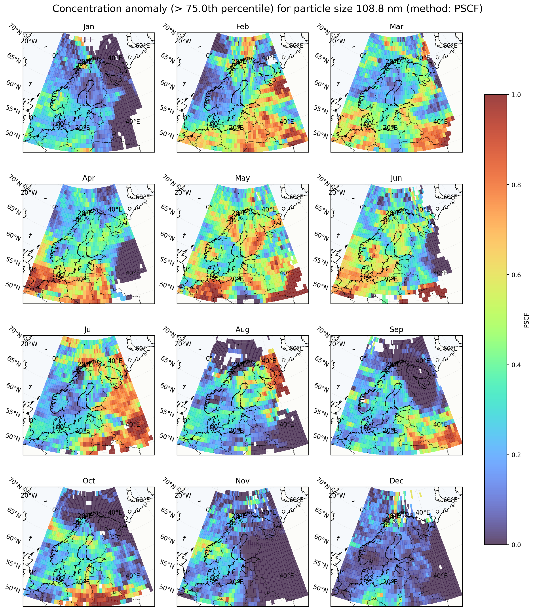
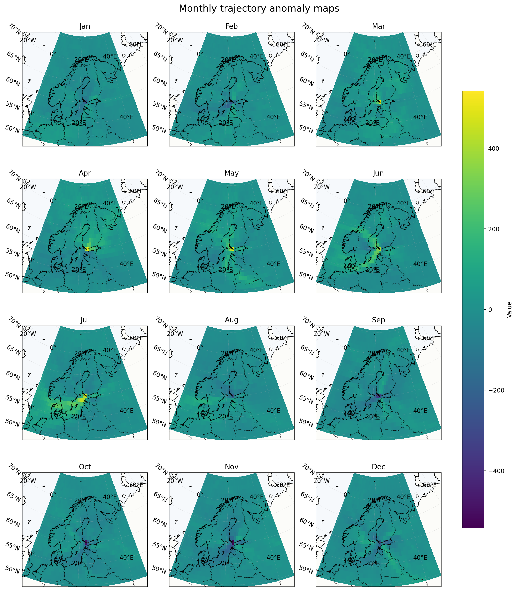

# Tvärminne station trajectory analysis

This repository contains an exploratory trajectory-analysis pipeline for back trajectories arriving at the Tvärminne measurement station. The goal is to implement [PSCF (Potential Source Contribution Function) and the concentration-field (CF) approaches](https://acp.copernicus.org/articles/13/2153/2013/acp-13-2153-2013.pdf) together with other useful plots of the measurement data.

## How to set up the project?

### 1. Set up virtual environment:
```
% python3.10 -m venv venv
% source venv/bin/activate
```

Python 3.10 or higher required!

### 2. Install requirements:
```
pip3 install -r requirements.txt
```

### 3. Retrieve data 

Raw data files are not committed to this repository due to size. Get [data](https://drive.google.com/file/d/1PUnODhPx2qdvTnDETKcWLZU494rbMX1f/view?usp=sharing) from Google Drive (may require access in which case contact Miikka Silfverberg). Unpack to produce a directory `data`:

```
% gdown "https://drive.google.com/file/d/1PUnODhPx2qdvTnDETKcWLZU494rbMX1f/view?usp=sharing"
% tar -xzvf hanko_data.tgz
```

## Check that data looks reasonable

```
% python3 scripts/eda.py --concentrations data/dmpsdata.mat --trajectories data/trajectorydata_clean.mat 
Trajectory file: data/trajectorydata_clean.mat
Concentration file: data/dmpsdata.mat

Concentration key paths:
['__globals__', '__header__', '__version__', 'dmpsData']

dmpsData:
  shape: (283758, 36)
  dtype: float64
  first row: [2.0240e+03 1.0000e+00 3.1000e+01 1.3000e+01 1.8000e+01 3.1000e+01
 0.0000e+00 0.0000e+00 1.0121e+05 3.0030e+02 2.1870e+01 1.0000e+01
 1.2010e+01 1.4430e+01 1.7340e+01 2.0840e+01 2.5040e+01 3.0090e+01
 3.6150e+01 4.3440e+01 5.2200e+01 6.2720e+01 7.5360e+01 9.0550e+01
 1.0881e+02 1.3074e+02 1.5708e+02 1.8877e+02 2.2681e+02 2.7254e+02
 3.2746e+02 3.9346e+02 4.7274e+02 5.6799e+02 6.8249e+02 8.2000e+02]

Trajectory key paths:
['None', '__function_workspace__', '__globals__', '__header__', '__version__', 'latitudes', 'longitudes', 'time_datenum']

Trajectories:
  latitudes shape:  (30289, 97)
  longitudes shape: (30289, 97)
  time shape:       (30289,)
  first time:       2022-02-15 02:00:00.000003349
  last time:        2025-07-31 02:00:00.000003349

First trajectory:
  arrival lat/lon:  59.84, 23.25
  final back point: 54.524, 0.606

Missing values:
  missing latitudes:  44232
  missing longitudes: 44232
```

## How to generate plots?

### PSCF plots for high particle concentration events

The following command generates monthly PSCF maps for a selected DMPS particle-size bin. High-concentration trajectories are defined using the chosen percentile threshold (--highperc), and each grid cell is assigned the fraction of trajectories passing through that cell that were associated with high particle concentration at Tvärminne. These plots are preliminary PSCF diagnostics and should be interpreted as air-mass pathway associations, not direct source-attribution maps.

```
python3 scripts/plot_pscf.py --concentrations data/dmpsdata.mat --trajectories data/trajectorydata_clean.mat --particlesize 25 --highperc 0.75 --outputfile plots/monthly_pscf_anomalies.png
```



### Overall monthly trajectory anomalies

This script illustrates monthly trajectory anomalies per grid cell. Positive values (yellower) indicate cells visited more often than the annual monthly mean for that cell; negative values (bluer) indicate cells visited less often. **Note that these plots do not show any particle concentrations**, only trajectory data.

```
python3 scripts/plot_monthly_trajectory_anomalies.py --trajectories data/trajectorydata_clean.mat --outputfile plots/monthly_trajectory_anomalies.png
```



